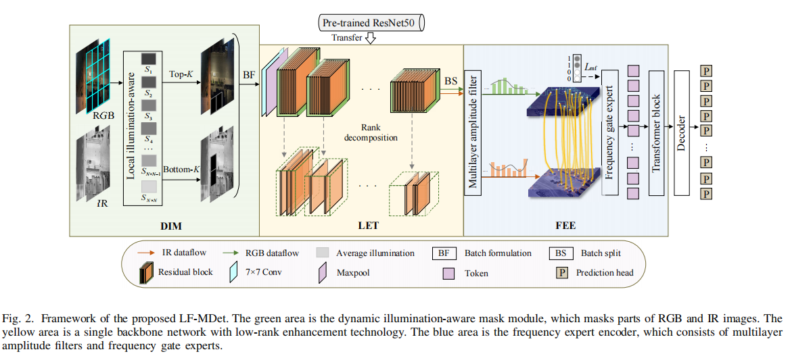
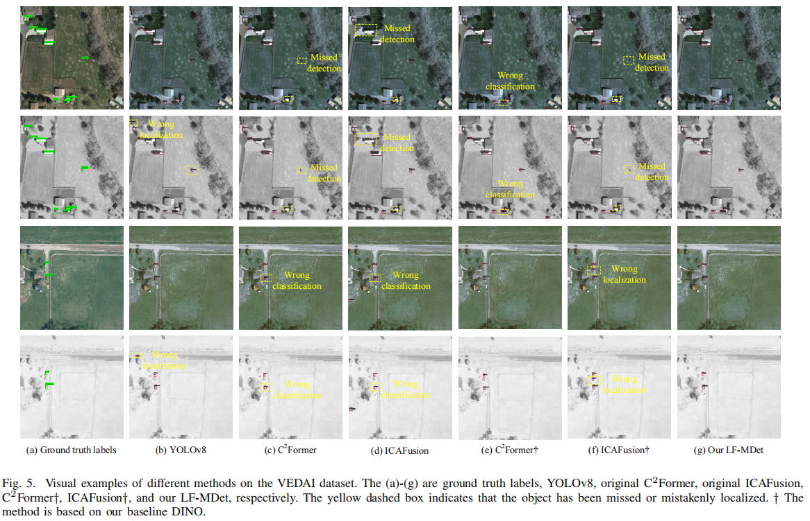
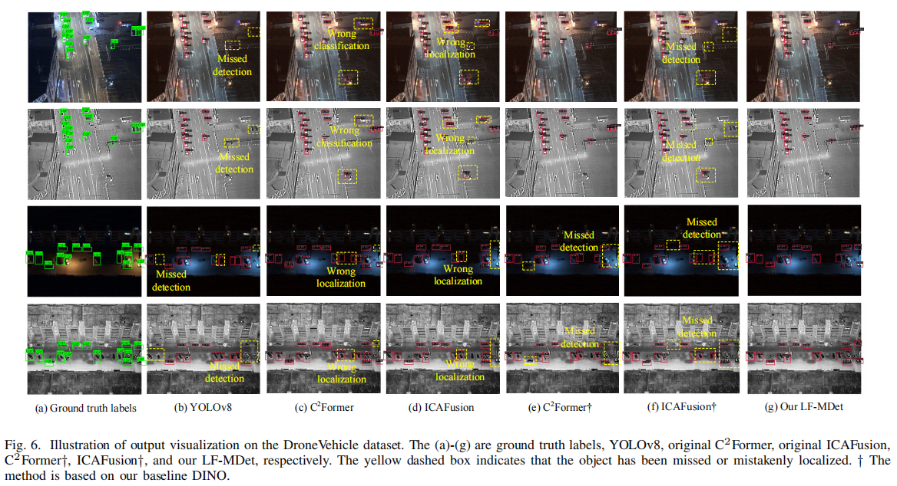

# LF-MDet
Codes for ***Low-rank Multimodal Remote Sensing Object Detection with Frequency Filtering Experts***

Xu Sun, Yinhui Yu*, and Qing Cheng


## Update
- [2024/7] This code will be released soon.


### ⚙ Network Architecture




## 🌐 Usage

**1. Virtual Environment**
```
conda env create -f environment.yml
```

**2. ultralytics YOLOv8**

The convert_yolo.py script is designed to facilitate the conversion of object detection annotations from the OpenMMLab format to the Ultralytics YOLO format.

The YOLOv8l model configured with different modalities and various data augmentation methods can be downloaded via the following links:
- [yolov8l_DA_rgb.pt](https://drive.google.com/file/d/10C0kFVE0htT-Yf36xzb4xyAjNNYUzJXU/view?usp=sharing)
- [yolov8l_DA_ir.pt](https://drive.google.com/file/d/1vQL8xdWB3uBQG5Eb0tV-Y-vva2Z52hSB/view?usp=sharing)
- [yolov8l_noDA_rgb.pt](https://drive.google.com/file/d/1mEOql6zFwJeKm4iecfHIQ5ehyqj11pxf/view?usp=sharing)
- [yolov8l_noDA_ir.pt](https://drive.google.com/file/d/1DlFF7crQm0aWLCluDdSDYe3nG_Ok5ax_/view?usp=sharing)


**3. LF-MDet Training**

Run 
```
source ~/.bashrc
conda activate openmmlab
which python
nohup python3  {config_path}\
    --work-dir  {checkpoint_path}\
    --gpu-ids 0 > {log_path}.log 2>&1 &
``` 
and the trained model is available in ``'./checkpoints/'``.


**4. LF-MDet Testing**

Run 
```
source ~/.bashrc
conda activate openmmlab
which python
python3  {config_path}\
    --work-dir  {checkpoint_path}\
    --eval bbox \
    --gpu-ids 0
``` 


**5. The visualizing detection results of our approach on the VEDAI and DroneVehicle datasets.**





